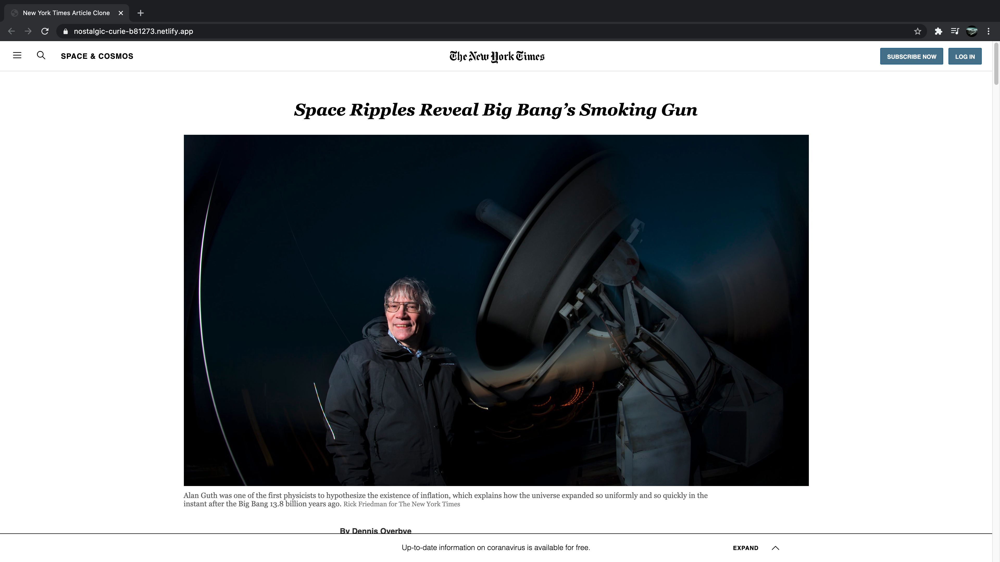

# New York Times Article Clone

> A clone of an article page of The New York Times.

This project demonstrates usage of CSS layout methods namely, CSS Grid, Flexbox and Floats.

## Built With

- HTML
- CSS

## Live Demo

[Live Demo Link](https://nostalgic-curie-b81273.netlify.app/)

## Getting Started

To get a local copy up and running, download/clone the repository and open index.html file with a browser of your choice.

## Authors

👤 **Mohammad Umar**

- Github: [@mohammadumar28](https://github.com/mohammadumar28)

👤 **Mark Rode**

- Github: [@m15e](https://github.com/m15e)

## 🤝 Contributing

Contributions, issues and feature requests are welcome!

## Show your support

Give a ⭐️ if you like this project!

## Acknowledgments

- New York Times
- The Odin Project
